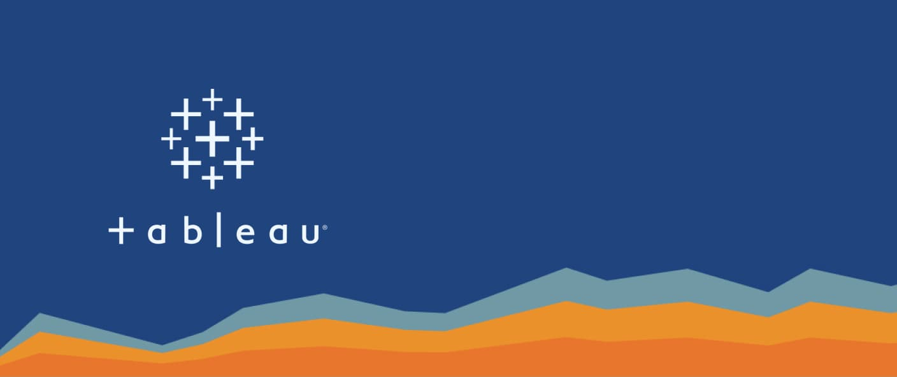

# 📊 Tableau Projects

  

Welcome to my **Tableau Projects** repository!  
This collection showcases a series of **interactive dashboards** built using **Tableau** — designed to uncover insights, visualize business data, and support data-driven decisions.

---

## About
Each project in this repository reflects practical applications of **data visualization**, focusing on:
- Business performance tracking  
- Trend and pattern analysis  
- KPI monitoring and storytelling with data  

The dashboards are based on real-world datasets and demonstrate the ability to transform raw data into meaningful insights through clean, interactive visual design.

---

## 🧰 Tools & Technologies
- **Primary Tool:** Tableau  
- **Data Sources:** CSV, Excel, SQL databases  
- **Focus Areas:** Data Analysis, Visualization Design, Storytelling  

---

## 🎯 Skills Highlighted
- Data Visualization & Dashboard Design  
- Business Intelligence & Analytical Thinking  
- Interactive Filtering & Parameter Controls  
- KPI & Trend Analysis  

---
## 👤 Author
**Vishal Malik**  
🔗 [LinkedIn](https://www.linkedin.com/in/vishalmalik18/)  
🔗 [GitHub](https://github.com/vishalmalik18)
